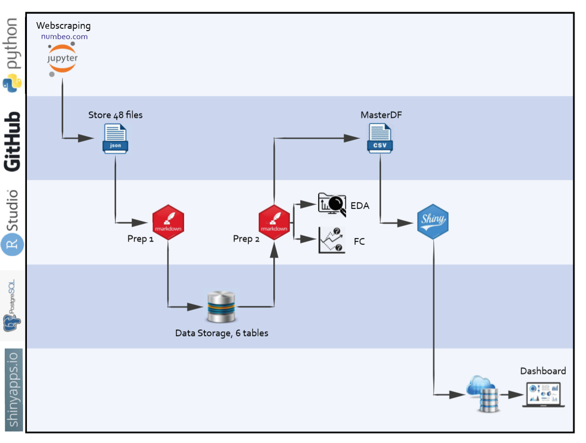
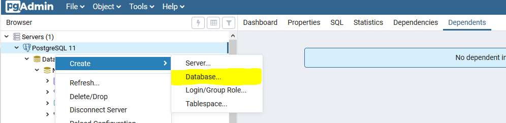

```{r setup, include=FALSE, echo=FALSE}
knitr::opts_chunk$set(echo = TRUE)
```


# Agenda

--

- Project Description

--

- Required Libraries

--

- PostgreSQL

--

- Data Wrangling and Preparation

--

- Exploratory Data Analysis incl. Hypothesis Testing

--

- Time Series Analysis and Forecasting

--

- Dashboarding in Shiny


---
class: center, middle
# Project Description

---
## Project Goals

--

- Analysis of perceived criminality 

--

 - Analysis of Numbeo data (globally)

--

 - Hypothesis testing (Germany)
 
--

- Time Series Analysis and Forecasting of criminality in Germany

--

- Dashboarding of Numbeo data

---
## Hypothesis

> The perceived criminality of people in Germany is not caused by actual criminality, but is driven by the negative news coverage of the refugee influx.

---
## Data Sources

--

**Numbeo** 

--

[Numbeo](https://www.numbeo.com) is the world’s largest database of user contributed data about cities and countries worldwide.  

Numbeo provides information on world living conditions including *cost of living*, *housing indicators*, *health care*, *traffic*, *crime* and *pollution*.  

--

**Statista**   

--

[Statista](https://de.statista.com/) is a German online portal providing statistical data collected by market and opinion research institutes and data derived from the economic sector and official statistics.  

We used it for statistical 'real' *crime rates* and number of *applications for asylum* in Germany.


---
## Architecture

.center[

]

---
class: center, inverse
background-image: url("pics/Github.PNG")
 
## [GitHub Repository](https://github.com/eibrahi/NumbeoR)

 
---
# Loading of Required Libraries

```{r echo=TRUE, message=FALSE}
library(tidyverse)

library(DBI)                           # for PostgreSQL
library(RPostgreSQL)                   # for PostgreSQL

library(jsonlite)                      # handling of JSON files
library(rjson)                         # handling of JSON files

library(plotly)                        # visualizations

library(corrplot)                      # visualizations of correlations
library(GGally)                        # visualizations of correlations

library(Hmisc)                         # calculation of correlations

library(fpp2)                          # forecasting/times series
library(fpp3)                          # forecasting/times series
library(tsibble)                       # tsibble object used for forecasting


```


---
class: center, middle

# Setup of PostgreSQL database

---
class: center, middle
## Technical setup of PostgreSQL

---

### Creation of a Database
A database with the name "NumbeoR" in PostgreSQL has to be created manually by the user. 

.center[

]

---
class: center, middle
### Establishing Connection to PostgreSQL

---
Every project member created a configFile with a personalised path to the (local) NumbeoR folder and password for PostgreSQL.

Now we are loading this configFile:
```{r echo=TRUE}
# load configfile
configFile <- fromJSON(file="configFile.json")
path <- configFile[1]
```


Here we establish the connection to the individual PostgreSQL datatabase with the name "NumbeoR"
```{r echo=TRUE}
pw = configFile[2]

# loads the PostgreSQL driver
drv <- dbDriver("PostgreSQL") 

# creates a connection to the postgres database; "con" is used to connect to the database
con <- dbConnect(drv, dbname = "NumbeoR",
                 host = "localhost", port = 5432,
                 user = "postgres", password = pw)

# removes the password
rm(pw)

```


---

### Creation of Tables

```{sql connection=con, include=FALSE}
DROP Table cost_of_living, crime, health_care, pollution, property_investment, traffic
```

Six different tables need to be created:

```{sql echo=TRUE, connection=con}
CREATE TABLE cost_of_living (
    "Year" integer,                                   -- Year
    "Country" text,                                   -- Country
    "Cost of Living Index" numeric,                   -- Cost of Living Index
    "Rent Index" numeric,                             -- Rent Index
    "Cost of Living Plus Rent Index" numeric,   
    "Groceries Index" numeric,                   
    "Restaurant Price Index" numeric,
    "Local Purchasing Power Index" numeric
);
CREATE TABLE crime (
    "Year" integer,                                   -- Year
    "Country" text,                                   -- Country
    "Crime Index" numeric,              
    "Safety Index" numeric
);
```

---
class: middle
```{sql echo=TRUE, connection=con}
CREATE TABLE health_care (
    "Year" integer,                                   -- Year
    "Country" text,                                   -- Country
    "Health Care Index" numeric,              
    "Health CareExp. Index" numeric                        
);
CREATE TABLE pollution (
    "Year" integer,                                   -- Year
    "Country" text,                                   -- Country
    "Pollution Index" numeric,              
    "Exp Pollution Index" numeric                       
);
```

---
class: middle
```{sql echo=TRUE, connection=con}
CREATE TABLE property_investment (
    "Year" integer,                                   -- Year
    "Country" text,                                   -- Country
    "Price To Income Ratio" numeric,              
    "Gross Rental Yield City Centre" numeric,                        
    "Gross Rental Yield Outside of Centre" numeric,   
    "Price To Rent Ratio City Centre" numeric,                   
    "Price To Rent Ratio Outside Of City Centre" numeric,                  
    "Mortgage As A Percentage Of Income" numeric,                   
    "Affordability Index" numeric                      
);
CREATE TABLE traffic (
    "Year" integer,                                   -- Year
    "Country" text,                                   -- Country
    "Traffic Index" numeric,              
    "Time Index(in minutes)" numeric,                        
    "Time Exp. Index" numeric,   
    "Inefficiency Index" numeric,                   
    "CO2 Emission Index" numeric                        
);
```

---
class: center, middle
## Data Import to PostgreSQL

---
class: middle

The basic activity in the beginning of the project is to read in the JSON files containing scraped data from NumbeoR, to create dataframe and finally memorizing the data into PostgreSQL.

```{r echo=TRUE}
# generate full path to the dataImport.json
pathToDataJson <- paste0(path, "daten/dataImport.json")
pathToTableJson <- paste0(path, "daten/tableNamesImport.json")

# reeding the dataImport and tableNames json
my_files <- fromJSON(file = pathToDataJson)
my_tables <- fromJSON(file= pathToTableJson)
```

---
class: middle
```{r echo=TRUE}
# creating lists
my_data <- list()
df_temp_my_data <- list()
df_my_data <- list()

for (i in 1 : length(my_files)) {
    # creating a list of JSON datafiles importing from Github
    my_data[[i]] <- fromJSON(file = my_files[i]) #<<
   
     # transform JSON files to dataframes, for each JSON file one dataframe
    df_temp_my_data[[i]] <- do.call(rbind.data.frame, my_data[[i]]) #<<
    
    # transpose dataframes to get the required structure
    df_my_data[[i]] <- as.data.frame(t(df_temp_my_data[[i]])) #<<
    
    # Writing data into PostgreSQL
    dbWriteTable(con, my_tables[i], value = df_my_data[[i]], append = TRUE, row.names = FALSE) #<<
}
```


---
class: center, middle
## Data Export from PostgreSQL

---
class: center, middle
### SQL Queries

---
#### Cost of Living in Germany

```{sql echo=TRUE, connection=con, output.var="CostOfLivingGermany"}
SELECT * 
  FROM cost_of_living
  WHERE "Country" = 'Germany';
```

```{r echo=FALSE}
knitr::kable(CostOfLivingGermany, format='html')
```

---
#### Countries with very high CO2 pollutions in 2019

```{sql echo=TRUE, connection=con, output.var="CountryCO2EmissonsTop"}
SELECT "Country", "CO2 Emission Index"
  FROM traffic
  WHERE "Year"=2019 AND "CO2 Emission Index" > 7500
  ORDER BY "CO2 Emission Index" DESC;
```

```{r echo=FALSE}
knitr::kable(CountryCO2EmissonsTop, format='html')
```

---

#### Average Crime Index from 2012 - 2019

```{sql echo=TRUE, connection=con, output.var="CrmeIndex"}
SELECT "Year", AVG("Crime Index")
  FROM crime
  GROUP BY "Year"
  ORDER BY "Year" ASC;
  
```

```{r echo=FALSE}
knitr::kable(CrmeIndex, format='html')
```


---
class: center, middle

### Creating Master Dataframe

---
#### Data Import from PostgreSQL

Import of the different tables with the help of *dbGetQuery* function

```{r echo=TRUE}
df_cost_of_living_postgres <- dbGetQuery(con, "SELECT * from cost_of_living")
df_crime_postgres <- dbGetQuery(con, "SELECT * from crime")
df_health_care_postgres <- dbGetQuery(con, "SELECT * from health_care")
df_pollution_postgres <- dbGetQuery(con, "SELECT * from pollution")
df_property_investment_postgres <- dbGetQuery(con, "SELECT * from property_investment")
df_traffic_postgres <- dbGetQuery(con, "SELECT * from traffic")
```

---
#### Joining Dataframes (Tables)

Joining the data to one master dataframe with a *nested full_join* function

```{r}
df_master <- full_join(full_join(full_join(full_join(full_join(df_cost_of_living_postgres, df_crime_postgres, by = c("Country", "Year")),df_health_care_postgres, by = c("Country", "Year")), df_pollution_postgres, by = c("Country", "Year")), df_property_investment_postgres, by = c("Country", "Year")), df_traffic_postgres, by = c("Country", "Year"))
df_master[1:10,1:4]
```


```{r echo=FALSE}
# df_master <- distinct(df_master) # In case there are duplicates in the PostgreSQL (e.g. multiple writing of the same data) this chunk can be run

```


---

class: center, middle

## Extend Master Dataframe with Continent 

---

Furthermore we would like to add the information in which continent the country is.

Therefore we import a table which includes a country-continent mapping.

```{r}
countryContinent <- read.csv(file="https://raw.githubusercontent.com/eibrahi/NumbeoR/master/daten/CountryContinent.csv",header=TRUE, sep=";")
colnames(countryContinent) <- c("Country", "Continent")
```

---

Checking the data types we see that the data was defined as factors

```{r}
glimpse(countryContinent[1:4,])
```

Therefore we change the data types to characters 
```{r}
countryContinent[] <- lapply(countryContinent, as.character)
```

```{r}
glimpse(countryContinent[1:4,])
```

---

Now we can join the continents to the master dataframe with the help of a left_join function:

```{r}
df_master_continent <- left_join(df_master,countryContinent, by="Country")
```

Checking the number of NA values within the column 'Continent' shows that there are no ones
```{r}
sum(is.na(df_master_continent["Continent"]))

```

```{r include=FALSE}
df_master_continent[rowSums(is.na(df_master_continent["Continent"])) > 0,]
```

---

For every country one contintent could be assigened.
```{r echo=FALSE}
glimpse(df_master_continent[1:2,])
```

---
class: center, middle

## Change the Column Names

---

We will change the column names so that there are no *blanks* anymore.
As example the code for changing the name of *Cost of Living* is shown.

```{r}
colnames(df_master_continent)[which(names(df_master_continent) ==
                        "Cost of Living Index")] <- "CostOfLiving"
```

```{r include=FALSE}
colnames(df_master_continent)[which(names(df_master_continent) == "Rent Index")] <- "Rent"
colnames(df_master_continent)[which(names(df_master_continent) == "Cost of Living Plus Rent Index")] <- "CostOfLivingPlusRent"
colnames(df_master_continent)[which(names(df_master_continent) == "Groceries Index")] <- "Groceries"
colnames(df_master_continent)[which(names(df_master_continent) == "Restaurant Price Index")] <- "RestaurantPrice"
colnames(df_master_continent)[which(names(df_master_continent) == "Local Purchasing Power Index")] <- "LocalPurchasingPower"
colnames(df_master_continent)[which(names(df_master_continent) == "Crime Index")] <- "Crime"
colnames(df_master_continent)[which(names(df_master_continent) == "Safety Index")] <- "Safety"
colnames(df_master_continent)[which(names(df_master_continent) == "Health Care Index")] <- "HealthCare"
colnames(df_master_continent)[which(names(df_master_continent) == "Health CareExp. Index")] <- "HealthCareExp"
colnames(df_master_continent)[which(names(df_master_continent) == "Pollution Index")] <- "Pollution"
colnames(df_master_continent)[which(names(df_master_continent) == "Exp Pollution Index")] <- "ExpPollution"
colnames(df_master_continent)[which(names(df_master_continent) == "Health Care Index")] <- "HealthCare"
colnames(df_master_continent)[which(names(df_master_continent) == "Price To Income Ratio")] <- "PriceToIncome"
colnames(df_master_continent)[which(names(df_master_continent) == "Gross Rental Yield City Centre")] <- "GrossRentalYieldCityCentre"
colnames(df_master_continent)[which(names(df_master_continent) == "Gross Rental Yield Outside of Centre")] <- "GrossRentalYieldOutsideOfCentre"
colnames(df_master_continent)[which(names(df_master_continent) == "Price To Rent Ratio City Centre")] <- "PriceToRentRatioCityCentre"
colnames(df_master_continent)[which(names(df_master_continent) == "Price To Rent Ratio Outside Of City Centre")] <- "PriceToRentRatioOutsideOfCityCentre"
colnames(df_master_continent)[which(names(df_master_continent) == "Mortgage As A Percentage Of Income")] <- "MortgageAsAPercentageOfIncome"
colnames(df_master_continent)[which(names(df_master_continent) == "Affordability Index")] <- "Affordability"
colnames(df_master_continent)[which(names(df_master_continent) == "Traffic Index")] <- "Traffic"
colnames(df_master_continent)[which(names(df_master_continent) == "Time Index(in minutes)")] <- "Time"
colnames(df_master_continent)[which(names(df_master_continent) == "Time Exp. Index")] <- "TimeExp"
colnames(df_master_continent)[which(names(df_master_continent) == "Inefficiency Index")] <- "Inefficiency"
colnames(df_master_continent)[which(names(df_master_continent) == "CO2 Emission Index")] <- "CO2Emission"
```

```{r}
glimpse(df_master_continent[1:3,1:13])
```

---

class: center, middle

## Data Selection

---
class: middle
Selection of some variables which are to be used in some of the analyses (e.g correlation analysis), storage in an analysis dataframe.

```{r}
df_analysis <- select(df_master_continent, Year, Country, 
    CostOfLiving, Rent, LocalPurchasingPower, 
    GrossRentalYieldCityCentre,
    GrossRentalYieldOutsideOfCentre,
    MortgageAsAPercentageOfIncome, Crime, HealthCare,
    Pollution, Traffic, Time,
    CO2Emission, Continent)

```

---

class: center, middle

# Data Understanding and Preparation

---
## General Approach

--

- Detailed inspection of data and data structure

--

- Data cleansing (e.g. outlier, NAs, NaNs)

--

- Final validation and verification of data set

---
class: center, middle

## Data Inspection

---

A summary of dataframe structure and data types can be illustrated with the glimpse function:
```{r}
glimpse(df_master_continent[1:3,1:15])
```

---
First we generate a summary of all variables:
```{r}
summary(df_analysis[,1:5])
```

---
```{r}
summary(df_analysis[,6:10])
```

---

```{r}
summary(df_analysis[,11:15])
```


---
class: center, middle

## Data Cleansing

---
### Deletion of Outliers


We see that the variable Mortgage As Percentage of Income has an outlier

```{r echo=FALSE, message=FALSE, warning=FALSE}
histo <- ggplot(data = df_analysis) +
  geom_histogram(mapping = aes(MortgageAsAPercentageOfIncome),bins=30) +
  scale_x_log10() +
  theme_light()
ggplotly(histo)
```

---
Class: middle 
Deletion of outliers:
```{r}
df_analysis <- df_analysis %>% 
  mutate(MortgageAsAPercentageOfIncome = 
           ifelse(MortgageAsAPercentageOfIncome>2000, 
                  NA, MortgageAsAPercentageOfIncome))

df_master_continent <- df_master_continent %>% 
  mutate(MortgageAsAPercentageOfIncome = 
           ifelse(MortgageAsAPercentageOfIncome>2000, 
                  NA, MortgageAsAPercentageOfIncome))
```

---
class: center, middle
```{r echo=FALSE, message=FALSE, warning=FALSE}
histo <- ggplot(data = df_analysis) +
  geom_histogram(mapping = aes(MortgageAsAPercentageOfIncome),bins=30) +
  scale_x_log10() +
  theme_light()
ggplotly(histo)
```

---
### Deletion of NA Values

Sum of NA values can be ascertained as following:
```{r}
sum(is.na(df_analysis))
```

The observations which contain at least one NA values can be identified with the following command:

```{r}
df_analysis[rowSums(is.na(df_analysis)) > 0,][1:4,1:5]
```

---
class: middle
All rows containing NA values can be deleted with the na.omit function:

```{r}
df_analysis_clean <- na.omit(df_analysis)

```

Checking on how many NA values are in the new clean dataframe shows that there are none

```{r}
sum(is.na(df_analysis_clean))
```

---
class: center, middle

# Exploratory Data Analysis (EDA)

---
## Approach and Goal

In this chapter we would like to examine the data especially with respect to the *Crime Index*.  

Here we would like to see if we can discover *correlations* between the Crime Index and other variables from Numbeo.  
 
Furthermore we would like to verify the *hypothesis* from the beginning:

>"The perceived criminality of people in Germany is not caused by actual criminality, but is driven by the negative news coverage of the refugee influx."

---
class: center, middle

## Data Preparation for EDA

---
### Dataframe for 2019
For later plottings we generate a separte dataframe with 2019 data.
```{r}
df_analysis_clean_2019 <- filter(df_analysis_clean, Year == 2019)
```

---
### Numeric Dataframe
For later correlations analysis we generate a separte dataframe with numeric variables.
```{r}
drops <- c("Year","Country", "Continent")
df_analysis_numeric <- df_analysis_clean[ , !(names( df_analysis_clean) %in% drops)]
#df_master_numeric <- na.omit(df_master_numeric)
```

---
### Dataframe for Germany

For some analysis we will focus only on German data
Filter dataframe only for Germany

```{r}
df_Germany <- filter(df_analysis_clean, Country=="Germany")
```

---

class: center, middle

## Correlations Numbeo Variables

---
### Correlation Matrix

First, a correlation matrix will be generated with the help of the corrplot package:  

```{r echo=FALSE}
corrplot(cor(df_analysis_numeric), method = "circle")
```


---
class: middle

For the *Crime Index* we assume a correlation especially with the  
* *Cost of Living Index*, 
* *Local Purchasing Power Index* and 
* *CO2 Emission Index*.  

This will be examined in the following.

---


### Crimes vs. Cost of Living

The function rcorr() [in Hmisc package] can be used to compute the significance levels (p-value) for pearson or spearman correlations. It returns both the correlation coefficients and the p-value of the correlation for all possible pairs of columns in the data table.
```{r}
corN <- rcorr(as.matrix(select(df_master_continent, Crime, CostOfLiving)))
corN
```

**Result**: No significant correlation is existing. 

see also [sthda](http://www.sthda.com/english/wiki/correlation-matrix-a-quick-start-guide-to-analyze-format-and-visualize-a-correlation-matrix-using-r-software)

---

### Crimes vs. Local Purchasing Power

Here, we show the (negative) correlation of two variables *Crime Index* and *Local Purchasing Power Index*:
```{r echo=FALSE}
corN <- rcorr(as.matrix(select(df_master_continent, Crime, LocalPurchasingPower)))
corN
```

**Result**: No significant correlation is existing. 

---

### Crimes  vs. CO2 Emission

Here, we show the (positive) correlation of the tow variables *Crime Index* and *CO2 Emission Index*:
```{r echo=FALSE}
corN <- rcorr(as.matrix(select(df_master_continent, Crime, CO2Emission)))
corN
```

**Result**: No significant correlation is existing. 

---

class: center, middle

## Correlations for Hypothesis Testing

---

### Crime Index vs. Number of Refugees

Correlation of perceived crimes and the estimated number refugees in Germany
(number of refugees is an estimation and is derived from accumulation of number of asylum seekers from 2012 till 2019)

```{r}
# Importing data for number of asylum seekers per year from CSV file (data comes from statista)
asylumSeekerGer <- read.csv(file="https://raw.githubusercontent.com/eibrahi/NumbeoR/master/daten/asylum_seeker_Germany.csv",header=TRUE, sep=";")
colnames(asylumSeekerGer) <- c("Year", "AsylumSeekerGermany", "AsylumSeekerGermanyCum")

# Join with Dataframe for Germany
df_corCrimeAsylumGer <- full_join(df_Germany,asylumSeekerGer,by="Year")
df_corCrimeAsylumGer[1:5,13:17]
```

.footnote[
The historical number of asylum seekers are from: [statista](https://de.statista.com/statistik/daten/studie/76095/umfrage/asylantraege-insgesamt-in-deutschland-seit-1995/)
]

---
class: middle

```{r echo=TRUE}
# Correlation analysis
corN <- rcorr(as.matrix(select(df_corCrimeAsylumGer, Crime, AsylumSeekerGermanyCum)))
corN
```

**Result**: The number of refugees in Germany is correlated with the perceived crime index. 

---
### Crime Index vs. Real Crime Rates

Correlation of perceived crimes and number of registered crime rates. 
(number of refugees estimated derived from cumulation of number of asylum seekers from 2012 till 2019)

```{r}
# Importing data for number of registered crimes (data comes from statista)
numberCrimesGer <- read.csv(file="https://raw.githubusercontent.com/eibrahi/NumbeoR/master/daten/crimeStatisticsGermany.csv",header=TRUE, sep=";")
colnames(numberCrimesGer) <- c("Year", "number_crimes")

# Join with Dataframe for Germany
df_corCrimePerRealGer <- full_join(df_Germany,numberCrimesGer,by="Year")
df_corCrimePerRealGer[1:5,]
```

.footnote[
The historical number of registered crimes are from: [statista](https://de.statista.com/statistik/daten/studie/197/umfrage/straftaten-in-deutschland-seit-1997/)
]

---
class: middle
```{r echo=TRUE}
# Correlation analysis
corN <- rcorr(as.matrix(select(df_corCrimePerRealGer, Crime, number_crimes)))
corN
```

**Result**: The real crime rates seem not to influence how secure people think they are. 

---
### Conclusion Hypothesis Testing

--

The hypothesis can be confirmed. 

--

The real crime rates do not have impact on how secure people feel.  

--

However, the number of refugees correlates with the how people perceive the crime rate.  

--

The reasons behind that should be analyzed in more depth. 

--

We think that the negative reportings in the media and politics lead to this results.  

---

## Visualizations

---

### Boxplots for Crime Index

```{r echo=FALSE}
crime_plot_2019 <- ggplot(data=df_analysis_clean_2019, mapping=aes(x=Continent, y=Crime)) +
                         geom_boxplot()
                     
ggplotly(crime_plot_2019)
```


---
### Scatter Plot

3-dimensional scatter plot with Traffic on the x-axis, Pollution on the y-axis and the Crime Index is reflected in the bubble sizes.

```{r echo=FALSE, warning=FALSE}
crimeTrafficPollution_plot_2019 <- ggplot(df_analysis_clean_2019) +
    geom_point(
        mapping = aes(x = Traffic, y = Pollution, size=Crime,color= Continent, points=Country)
        )

ggplotly(crimeTrafficPollution_plot_2019)
```


---
class: center, middle

# Forecasting / Times Series Analysis


---

## General 

What? 
We are going to analyse the **crime rate**.

What for?
We are analyizing the crime rate for **Germany**?

For which time horizon?
We are analyizing the crime rate for Germany for the years **2012 until 2019**?


.footnote[
Note:
This chapter is in general according to [Forecasting: Principles and Practice - February 2019](https://otexts.com/fpp3/) and [Forecasting: Principles and Practice - April 2018](https://otexts.com/fpp2/) by Rob J Hyndman and George Athanasopoulos 
]

---
class: center, middle

## Data Preparation

---
### Preparation Dataframe


There are diffrent objects that are be used in the forecasting fpp package:
* tsibbles
* vectors -> timeseries

---

### Data Transformation into Tsibble

A time series can be thought of as a list of numbers (the measurements), along with some information about what times those numbers were recorded (the index). This information can be stored as a tsibble object in R.

```{r}
tsibble_Germany <- as_tsibble(df_Germany, index=Year)
```

```{r echo=FALSE}
class(tsibble_Germany)
```

```{r echo=FALSE}
tsibble_Germany[,1:5]

```


---
### Data Transformation into Vectors and Time Series   

In order to be able to work with the partial data sets later, we split the respective dataframe into individual vectors for different indexes.


```{r}
crimeGermanyVector <- df_Germany[,9]
costOfLivingVector <- df_Germany[,3]
healthCareVector <- df_Germany[,11]
pollutionVector <- df_Germany[,13]
crimeGermanyVector
```


```{r include=FALSE}
class(crimeGermanyVector) # Class of the vector
```

---

Now we convert the vectors into times series.
```{r}
crimeGermanyTS <- ts(crimeGermanyVector, start=2012, end=2019, frequency=1)
costOfLivingGermanyTS <- ts(costOfLivingVector, start=2012, end=2019, frequency=1)
healthCareGermanyTS <- ts(healthCareVector, start=2012, end=2019, frequency=1)
pollutionGermanyTS <- ts(pollutionVector, start=2012, end=2019, frequency=1)
crimeGermanyTS
class(crimeGermanyTS)
```


---
class: center, middle

## Model Choice

---
There are many different models to analyize times series. 

How do we chose the right model?
* *Visual inspection*: is there seasonality or trend?
* Is decomposition technique *additive* or *multiplicative*? (Log tranformation if required)
* Chosing the appropriate model, e.g. 

Model                                  |   Seasonal?  |    Trend?    | Correlations?
---------------------------------------|--------------|--------------|--------------
Simple Moving Average Smoothing        |      no      |     yes      |      no 
Seasonal Adjustments                   |      yes     |     yes      |      no 
Simple Exponential Smoothing           |      no      |     yes/no   |      no 
Holts Exponential Smoothing            |      no      |     yes      |      no 
Holt-Winters Exponential Smoothing     |      yes     |     yes      |      no 
ARIMA                                  |      yes     |     yes      |      yes 

* Testing of the model
* Verification of the model performance

.footnote[
According to [Data Science - Part X - Time Series Forecasting](https://www.youtube.com/watch?v=msFkHl7P28k&t=1922s) by Derek Kane
]

---


### Visual Inspection

---

#### Crime Index Germany

```{r echo=FALSE}
autoplot(tsibble_Germany,Crime, col="black") +
    labs(title = "Crime Index Germany", subtitle = "Years 2012-2019") +
    xlab("Year")

```

---
#### Overall overview 
```{r echo=FALSE}
par(mfrow=c(2,2))
plot(crimeGermanyTS, col="black", main="Crime Index Germany")
plot(costOfLivingGermanyTS, col="red", main="Cost of Living Index Germany")
plot(healthCareGermanyTS, col="orange", main="Health Care Index Germany")
plot(pollutionGermanyTS, col="purple", main="Pollution Index Germany")

```

---

#### Correlations

```{r echo=FALSE}
library(GGally)
ggCorAnalysis <- select(df_analysis_numeric, HealthCare, Pollution, Crime, CostOfLiving)
GGally::ggpairs(ggCorAnalysis)
```


---


#### Conclusion

As there are no significant correlations and no seasonal components, models like 
* Simple forecasting methods
* Simple Moving Average Smoothing
* Simple Exponential Smoothing
* Holts Exponential Smoothing  

can be used.

---
class: center, middle

## Modelling

---
class: center, middle
### Some simple forecasting methods

---

#### Average method

The forecasted values are equal to the average (or **“mean”**) of the historical data. 
h is the time horizon for the forecast.
```{r echo=FALSE}
meanf(crimeGermanyTS, h=3)
```


---

#### Naïve method (random walk forecasts)

The **last value** of the historical data is set as predicted value. 
h is the time horizon for the forecast.
```{r echo=FALSE}
naive(crimeGermanyTS, h=3)
```

Variation: **Drift method**   
Change over time (=drift) is the **average change** in the historical data.
```{r echo=FALSE}
driftCrime <- rwf(crimeGermanyTS, h=3, drift=TRUE)
driftCrime

```


---
#### Plotting the forecasts

```{r echo=FALSE}
crimeGermanyPlot <- window(crimeGermanyTS,start=2012,end=2019)
# Plot some forecasts
autoplot(crimeGermanyPlot) +
  autolayer(meanf(crimeGermanyPlot, h=3),
    series="Mean", PI=FALSE) +
  autolayer(naive(crimeGermanyPlot, h=3),
    series="Naïve", PI=FALSE) +
  autolayer(rwf(crimeGermanyTS, h=3, drift=TRUE),
    series="Naïve Drift Method", PI=FALSE) +
  ggtitle("Forecasts for Crime Index") +
  xlab("Year") + ylab("Crime Index") +
  guides(colour=guide_legend(title="Forecast"))
```


---

#### Evaluating Forecast Accuracy

For the three methods Mean, Naïve Method and Drift Method the Accuracy can be deducted from comparison of forecasts 2017-2019 and real data.


```{r include=FALSE}
crime1 <- meanf(window(crimeGermanyTS, start=2012, end=2016), h=3)
crime2 <- rwf(window(crimeGermanyTS, start=2012, end=2016), h=3)
crime3 <- rwf(window(crimeGermanyTS, start=2012, end=2016), drift=TRUE, h=3)
autoplot(crimeGermanyPlot) +
  autolayer(crime1, PI=FALSE, series="Mean") +
  autolayer(crime2, PI=FALSE, series="Naïve") +
  autolayer(crime3, PI=FALSE, series="Naïve Drift Method") +
  xlab("Year") + ylab("Crime Index") +
  ggtitle("Forecast for Crime Index Germany") +
  guides(colour=guide_legend(title="Forecast"))
```


```{r echo=FALSE, warning=FALSE, message=FALSE}
# Set training data from 2012 to 2016
train <- select(tsibble_Germany, Crime) %>% filter_index("2012" ~ "2016")
# Fit the models
crime_fit <- train %>%
  model(
    `Mean` = MEAN(Crime),
    `Naïve` = NAIVE(Crime),
    `Drift` = NAIVE(Crime ~ drift())
  )
# Generate forecasts for 3 years
crime_fc <- crime_fit %>% forecast(h=3)
# Plot forecasts against actual values
crime_fc %>%
  autoplot(train, level = NULL) +
    autolayer(filter_index(select(tsibble_Germany, Crime), "2016" ~ "2019"), color = "black") +
    ggtitle("Forecast for Crime Index Germany") +
    xlab("Year") + ylab("Crime Index") +
    guides(colour=guide_legend(title="Forecast"))
```


---
class: center, middle
### Simple exponential smoothing

---
#### General

Exponential smoothing models:
* weighted averages of past observations  
* the older the (past) observation is the (exponentially) lower is the weigh

Simplest model is the **Simple Exponential Smoothing model (SES)**.  
It is suitable for forecasting data with no clear trend or seasonal pattern.

---

#### Flat forecasts
Simple exponential smoothing has a “flat” forecast  

```{r}
crimeGermanySes <- window(crimeGermanyTS,start=2012,end=2019)
fc_ses <- ses(crimeGermanySes, h=3)
fc_ses

```

---
Optimazation of the model:

No trend and seasonal component assumed. As optimization criterion the Mean Squared Error (MSE) is chosen. 

```{r}
# Estimate parameters
fit_ets <- tsibble_Germany %>%
  model(ETS(Crime ~ error("A") + trend("N") + season("N"), opt_crit = "mse")) #<<
fc_ets <- fit_ets %>%
  forecast(h = 3)

# Accuracy of one-step-ahead training errors
accuracy(fit_ets)
```

---

```{r echo=FALSE}
fc_ets %>%
  autoplot(tsibble_Germany) +
  geom_line(aes(y = .fitted, colour = "Fitted"), data = augment(fit_ets)) +
  ylab("Crime Index") + xlab("Year")
```

In red the one-step-ahead fitted values plotted

---
Including an (additive) trend perspective will change the forecast.  
No seasonal component assumed. As optimization criterion the Mean Squared Error (MSE) is chosen. 
```{r}
# Estimate parameters
fit_ets2 <- tsibble_Germany %>%
  model(ETS(Crime ~ error("A") + trend("A") + season("N"), opt_crit = "mse")) #<<
fc_ets2 <- fit_ets2 %>%
  forecast(h = 3)

# Accuracy of one-step-ahead training errors
accuracy(fit_ets2)
```

---
#### Trend forecasts
```{r echo=FALSE}
fc_ets2 %>%
  autoplot(tsibble_Germany) +
  geom_line(aes(y = .fitted, colour = "Fitted"), data = augment(fit_ets2)) +
  ylab("Crime Index") + xlab("Year")
```

---

### Autocorrelation  
Autocorrelation measures the linear relationship between lagged values of a time series.

```{r echo=FALSE}
#lag.plot(crimeGermanyTS,lags=7,do.lines=FALSE) # Variante 1

tsibble_Germany %>%  gg_lag(Crime, geom="point")  # Variante 2
```

The autocorrelations are the correlations associated with these scatter plots.
The highest positiv relationship is at lags 1 and 2.

---

The autocorrelations coefficients are displayed by the autocorrelation function ggAcf function  


```{r echo=FALSE, message=FALSE, warning=FALSE}
# ggAcf(crimeGermanyTS) # Variante 1
autoplot(ACF(tsibble_Germany, Crime)) # Variante 2

```

---
class: middle
The dashed blue lines (±2/√T where T is the length of the time, in our case ±0,76) indicate whether the correlations are significantly different from zero.
In our case no correlation is significant. 
Time series that show no autocorrelation are called *white noise*. 

---
class: center, middle

### Linear Model

---

Could there exist a linearity?
```{r warning=FALSE, message=FALSE}
tsibble_Germany %>% select(Crime) %>% 
  ggplot(aes(x=Year, y=Crime)) + ylab("Crime Index)") + xlab("Years") +
    geom_point() + geom_smooth(method="lm", se=FALSE)
```

---

```{r}
tsibble_Germany %>%
  model(TSLM(Crime ~ Year)) %>%
  report()
```

Constraints for our use case:
* In year 0 we certainly did not have a Crime Index of -4199
* Furtermore, an improvement of the crime index is possible and probable over a long period leading to a non-linearity
---
class: middle 
Now we will create a linear forecast.

First we train the model with TSLM() (time series linear model).

```{r}
fit_tslm <- tsibble_Germany %>%  model(trend_model = TSLM(Crime ~ trend()))

```


---
Assuming that the linear development will continue we plot the scenario funnel.

```{r echo=FALSE}
fit_tslm %>% forecast(h = "3 years") %>%
    autoplot(tsibble_Germany) +
    ggtitle("Crime Index for Germany") + ylab("Crime Index")
```

---
# Overall conclusion

**Results of the Hypothesis testing**

* The perceived crime rate correlates positively with the number of refugees.  
* This could lead to the conclusion that the refugees increase the real crime rate.   
* For our topic of observation (crime index in Germany) it is *not an issue of refugees* because the the real crime rate did not worsen.    
* We assume that the perception is caused by how this topic is handeled in the *media*.  
* Our advice to the respective decision-makers is to further analyse this specific assumption. 

**Results of the forecasting**  
* The application of pure *data-driven models* based on historical data is not appropriate to come to conclusions how the crime index will develop in future.   
* Furthermore *domain knowledge* is required to come to conclusions about the reasons for the past increase and how to improve the situation.  


---
class: center, middle
# Dashboarding in Shiny

---
## Data Export 
The complete master dataframe and clean dataframe is exported for further usage in Shiny dashboarding.
```{r}
pathForShiny1 <- paste0(path,"daten/MasterDF.csv")
pathForShiny2 <- paste0(path,"daten/CleanDF.csv")
write.csv(df_master_continent,pathForShiny1, row.names = FALSE)
write.csv(df_analysis_clean,pathForShiny2, row.names = FALSE)
```

---
class: center, middle
## Shiny App
Please open the [Shiny App](https://numbeo.shinyapps.io/NumbeoS/).
